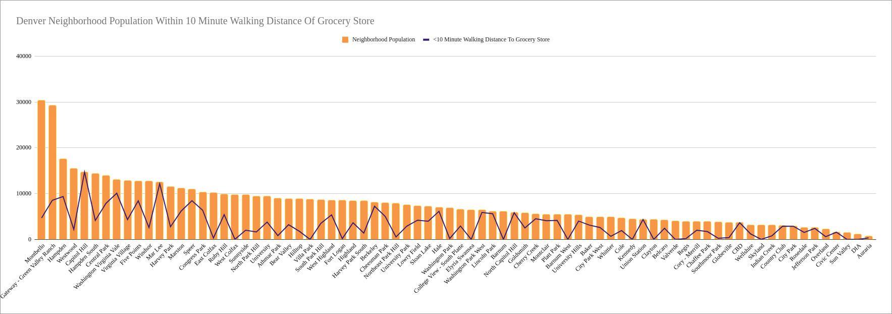

# alongwaytowalk
Data science solution for a hypothetical business problem involving transit and food deserts in Denver, CO.

# **A Long Way To Walk**
### *Eliminating Food Deserts With Multimodal Transit*

#### **Abstract**

The goal of this project was to use a clustering model to find pockets of roads in urban Denver that fit a specific set of characteristics, with the goal of improving access to food via changes to existing mobility options. I worked with data from the Regional Transit District of Denver, the Colorado Department of Transportation, and the 2020 US Census. This stage of the project was meant to be a proposal for the use of a clustering algorithm, which I approximated by way of dual Tableau dashboards.

#### **Design**

This project originates from my experience as a Denver resident for multiple decades, during which time Denver’s population has exploded along with the number of residents without easy access to nutritional sources (those living in “food deserts”). As the Denver municipal government and CDOT both maintain an excellent open-access data library, I pulled almost all of my data directly from there. The idea was essentially to overlay a specific segment of Denver census data with another specific segment of roadways in the greater Denver metropolitan area. Clustering candidates of roads effectively would give transportation planners a set of ideal starting points with which to close first/last mile transportation gaps in urban spaces, as well as improve the overall efficiency of motorized travel in Denver, potentially get a great deal of single-occupant vehicles off the road, and ultimately provide many people a means to improve their socioeconomic status.

#### **Data**

There are five datasets in use:

  - Local Roads – 174,000 rows, 37 features (numerical and categorical)
  - Traffic Counts – 5,900 rows, 8 features (numerical and categorical)
  - Food Access By Neighborhood – 78 rows, 6 features (numerical and categorical)
  - Food Access By 2020 Census Tract – 134 rows, 6 features (numerical and categorical)
  - Denver Food Deserts – 26 rows, 15 features (numerical and geospatial)
        
#### **Algorithms**

At this stage, no algorithms have been applied to the data beyond very basic arithmetic functions to view percentages and aggregations of specific data features. However, the proposed algorithm to be developed is a clustering algorithm. 

#### **Tools**

  - Google Sheets for data storage, cleaning, and basic visualizations
  - Tableau for interactive visualizations

#### Communication

In addition to the slides and visuals presented live (12/15/2021), this presentation will be available on my personal GitHub.

#### See For Yourself!

[Tableau Dashboard - Morning/Evening Peak Hourly Volume of Denver Roadway Segments](https://prod-useast-b.online.tableau.com/#/site/mattstableauformetis/views/firststeps/AMPMTrafficVolume_1?:iid=1)

[Tableau Dashboard - Denver Food Access by Neighborhood & Census Tract](https://prod-useast-b.online.tableau.com/#/site/mattstableauformetis/views/firststeps/PopulationFoodAccessMap_1?:iid=1)

[Google Sheets - Raw(ish) Data](https://docs.google.com/spreadsheets/d/1bU-27FbNMjM-rRObvEFSbAyiDNF661iDJxwELnXJ9B4/edit?usp=sharing)

[Presentation Slides](https://docs.google.com/presentation/d/1npDgUVEpkPoBZRc1vGv1FOAD3FtINq2Xb2a_mC4_5-I/edit?usp=sharing)

